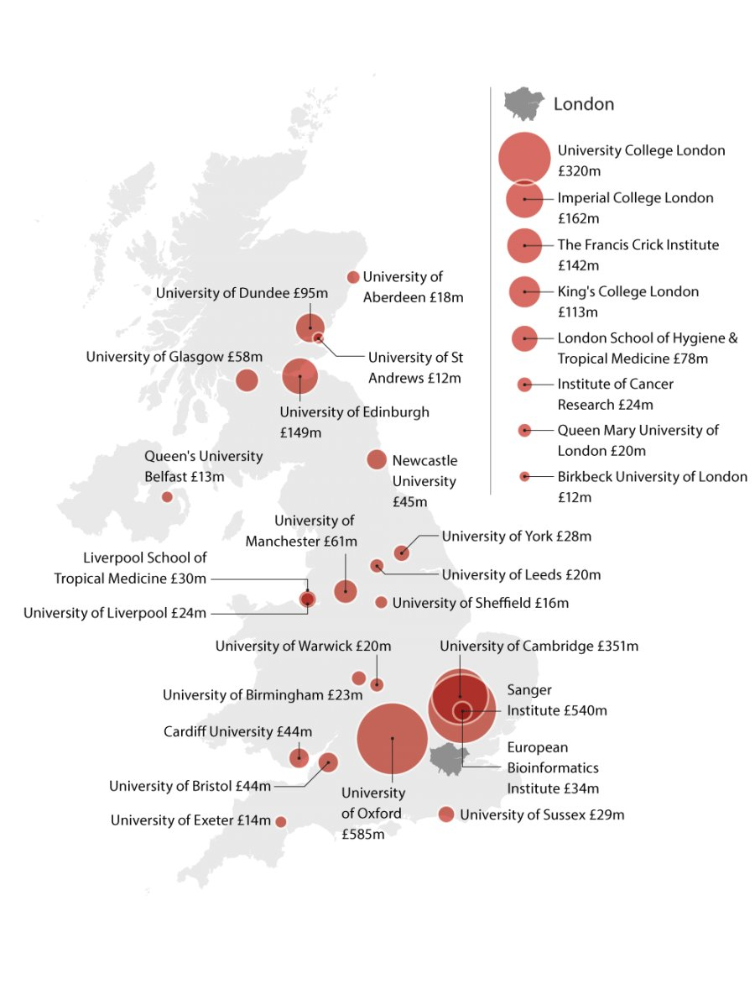

```{r setup, include=FALSE}
knitr::opts_chunk$set(echo = TRUE)
```

## Comparison of Wellcome funding vs REF

REF2014 results downloaded from {here} (https://results.ref.ac.uk/(S(bv303dun0r1vbk311t4bheka))/)

Wellcome data from here:


Question had been raised if Wellcome was biased in favour of places that were geographically close to London.

Counter-view was that Wellcome funding should be similar to REF outcomes.
NB this is not the 'quality' score, which is based on percentages of outputs in different categories: it should be the 'strength' measure, which takes into account the number of researchers. The latter makes sense for funding decisions: i.e. funding will relate to the volume of quality research, rather than average quality per researcher.

First we read in the REF data. Need to delete the top rows and save as .csv before you do this.

```{r readref}
require(tidyverse)
require(knitr)
myref <- read.csv('REF2014 Results.csv',stringsAsFactors=FALSE)
shortref <- filter(myref,Profile=='Outputs')
shortref <- filter(shortref,Main.panel=='A')
#Assume we should just focus on Panel A, which has medicine, neuroscience, etc.

#Make the names more useful
colnames(shortref)[1]<-'UKPRN'
colnames(shortref)[2]<-'Institution'
colnames(shortref)[11]<-'Nstaff'
shortref$Institution<-as.factor(shortref$Institution)
shortref<-shortref[,-c(7:9)] #get rid of spurious columns
#get rid of '-' and turn into NA,and make scores numeric
for (i in 1:5){
  w<-which(shortref[,(i+8)]=='-')
  shortref[w,(i+8)]<-NA
  shortref[,(i+8)]<-as.numeric(shortref[,(i+8)])
}
shortref<-mutate(shortref, N4 = Nstaff *X4.)
shortref<-mutate(shortref, N3 = Nstaff *X3.)
shortref<-mutate(shortref, N2 = Nstaff *X2.)
shortref<-mutate(shortref, N1 = Nstaff *X1.)
shortref<-mutate(shortref, N0 = Nstaff *unclassified)
```

```{r createagg}
#Create a new table that sums across units of assessment: updated to include Nstaff
mytab<-aggregate(shortref[,c(8,14:18)], by=list(Category=shortref$Institution), FUN=sum)
mytab$REFtot<-4*mytab$N4+mytab$N3 #I think this is how the total score was computed
#ie only 3* and 4* count and 4* counts four times as much as 3*
write_csv(mytab,'reftab.csv')
#This table has institutions x ref scores
```

```{r readreftab}
#added Wellcome funding by hand to reftab and renamed to reftab2 before reading it in.
welltablong<-read_csv('reftab2.csv')
welltab<-filter(welltablong,Wellcome>0) #ignore those with no Wellcome funding
#We will turn values into logs to make manageable
x<-log(welltab$REFtot)
y<-log(welltab$Wellcome)
reg1 <- lm(y~x) 
summary(reg1)
set.seed(28) #placement of labels a bit random to avoid overlaps
#trial and error to get seed that makes random numbers reasonably visible
#( in ggplot can use ggrepel to do this)
myrow=nrow(welltab)
mypos<-sample(1:4,myrow,replace=TRUE)

plot(x,y,xlab='log REF',ylab='log Wellcome',xlim=c(8,13),ylim=c(2,7))
     text(x,y,labels=welltab$shortname,cex=0.6,pos=mypos)
abline(reg1,col=2)

sortedwell <- welltablong[order(welltablong$REFtot),] 

nowell<-filter(sortedwell,REFtot>10000,Wellcome==0)
```


# Look at places with no Wellcome funding
Are any high on REF?
Take 10000 as REF score as cutoff. Only two Wellcome funded places are lower than this: Liverpool School of Tropical Medicine, and Birkbeck.
Here are the places with higher REF ratings but not featuring on Wellcome map.
`r kable(nowell[,c(1,8)])`


# Look at relation to N staff

```{r nstaff}
x1<-log(welltab$Nstaff)
y<-log(welltab$Wellcome)
reg2 <- lm(y~x1) 
plot(x1,y,xlab='Nstaff',ylab='Wellcome',xlim=c(3,7.5),ylim=c(2,7))
     text(x1,y,labels=welltab$shortname,cex=0.6,pos=mypos)

abline(reg2,col=2)
cor(welltab[,c(2,8,9)])

```